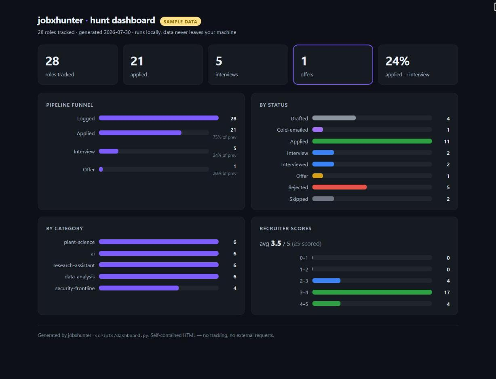

<p align="center">
  
</p>

<h1 align="center">jobxhunter</h1>

<p align="center"><strong>Fills the gap to the job. Recommends the gaps to close.</strong></p>

<p align="center">
  It searches live UK and Canada jobs, tailors an ATS-safe CV that fits each role from your real experience, and names the exact gaps worth closing.
</p>

<p align="center">
  
  
  
  
</p>

<p align="center">
  
</p>

---

jobxhunter searches live UK and Canada job boards, tailors an ATS-safe CV that fits each role from your real experience, then names the exact gaps worth closing. It sources through real API connectors with a web-search fallback, scores every draft with an independent recruiter agent, tracks the whole pipeline, and preps you for the interview. It drafts. You review and send.

It works from one master profile of your real history, so nothing on the page is invented. Where your experience falls short of a role, it shows you the gap and how to close it, rather than faking a match.

**On one real UK role, blind-scored by the independent recruiter agent:**

<p align="center">
  <strong>4.0 / 5</strong> &nbsp;·&nbsp; <strong>0 fabrications</strong> &nbsp;·&nbsp; <strong>4 real gaps flagged to close</strong>
</p>

---

## Why I built this

I was hunting for a job in the UK, and I built this to take the grunt work off my plate: re-cutting the CV for every role, mapping it to the job description, keeping it honest and ATS-readable, filing it, tracking it.

It worked. I found a job. Then a friend in Canada asked me to run their search too, so I made Canada work out of the box. Then a friend in Italy asked. So instead of hard-coding one country, I made the market a setting, and more are on the way.

It works from your real history and shows you the gaps to close, rather than filling them, because a single made-up line is what ends an interview.

It's the tool I used for my own hunt, and my friends used for theirs. It's yours now too.

[Soheil](https://github.com/soheilfallah)

---

## Quick start

```
/plugin marketplace add soheilfallah/jobxhunter
/plugin install jobxhunter@soheil-jobxhunter
/jobxhunter:setup
```

`setup` scaffolds a private workspace. Drop your old CVs and notes into the `dump/` folder it makes, run `/jobxhunter:intake` to build your master profile, then `/jobxhunter:tailor` a role (or `/jobxhunter:hunt` to find and tailor many). Say *"I applied to this one"* and the tracker row locks.

> ⭐ If it saves you one wasted application, a star helps other job-hunters find it.

---

## What makes it different

- **The search does the digging.** It pulls live roles from Reed, Adzuna and Firecrawl with a web-search fallback, reads the full job description behind Workday, Greenhouse and Lever links, and the autonomous daily hunt sources, triages, tailors and files every new match on its own.
- **It fits you from your real experience.** The master profile is the only source of truth for a submittable document, and every CV is shaped for both the ATS parser and the six-second recruiter scan. No fabricated titles, numbers, or skills.
- **Then it recommends the gap to close.** Where a role needs something you cannot evidence, jobxhunter shows you the gap instead of papering over it. In its alternative-world mode it sketches the ideal candidate and the shortest path from you to them, a roadmap you can act on and never something it submits.
- **The recruiter loop is genuinely independent.** A JD-specific recruiter persona scores each draft and demands fixes until it passes. In Claude Code the scoring runs in a separate `recruiter-critic` agent that sees only the JD and the finished CV, never the writer's own notes, so it cannot rubber-stamp itself. In testing it caught the tailorer drifting into unsupported buzzwords and stripped them.
- **It doesn't stop at "applied".** Once a role is filed, `/jobxhunter:interview` builds a prep pack from the same coverage matrix: predicted questions, STAR answers from real evidence, and an honest defence for the exact gaps the CV surfaced. A deterministic keyword check confirms the must-have terms actually landed on the page (a parse diagnostic, never a fake "match score").
- **No slop.** A researched ban-list blocks phrasing like *"results-driven team player, passionate about synergy."*
- **Two markets, more coming.** UK and Canada both work out of the box (A4 vs US-Letter, British vs Canadian spelling, Reed/Adzuna vs Job Bank / Indeed.ca). Market is read from your profile, not hard-coded.

---

## Validated

Run end-to-end on live UK job descriptions, each CV blind-scored by the independent recruiter agent (the tailorer never grades its own work):

| Case | Level | Recruiter score |
|---|---|---|
| Strong-match research placement | L1 | **4.0 / 5** |
| Research assistant (partial fit) | L1 | 2.9 / 5, real gap surfaced not faked |
| Junior ML engineer (genuine stretch) | L1 + letter | 2.9 / 5, missing stack disclosed |

A true match scored 4.0; genuine stretches scored lower, with the reasons stated on the page. ATS-safety was verified in the document XML. The fixtures live in [`evals/`](evals/).

---

## Commands

| Command | What it does |
|---|---|
| `/jobxhunter:setup` | Scaffold your private workspace and connect job boards (bring your own keys) |
| `/jobxhunter:intake` | Build your master profile from a folder of raw files: old CVs, LinkedIn export, notes, certificates |
| `/jobxhunter:hunt` | Autonomous daily hunt. Sources, triages, and tailors every new live role, then files it |
| `/jobxhunter:tailor` | Tailor an ATS-safe CV to one job description, with the recruiter scoring loop |
| `/jobxhunter:cover-letter` | Draft a cover letter in your own voice, to your market's conventions |
| `/jobxhunter:discover` | Find target companies in the hidden job market and draft a cold email to the named contact |
| `/jobxhunter:interview` | Prep from a filed role: predicted questions, STAR answers from real evidence, honest gap-defence |
| `/jobxhunter:dashboard` | Build a shareable HTML dashboard of your hunt (funnel, status, scores) from the tracker |

You can also just talk to it in plain language. The commands are shortcuts.

---

## Install

### Plugin (recommended)

In Claude Code:

```
/plugin marketplace add soheilfallah/jobxhunter
/plugin install jobxhunter@soheil-jobxhunter
/reload-plugins
```

Or from a terminal, for scripted setups:

```bash
claude plugin marketplace add soheilfallah/jobxhunter
claude plugin install jobxhunter@soheil-jobxhunter
```

> [!IMPORTANT]
> **You'll want free API keys for the job connectors.** Claude Code prompts for them during install, and nothing is committed. jobxhunter *runs* without them, because sourcing falls back to web search, but you get fewer roles and job descriptions aren't deep-crawled.
>
> | Connector | Get a free key | What you lose without it |
> |---|---|---|
> | **[Adzuna](https://developer.adzuna.com/signup)** ⭐ | `developer.adzuna.com/signup` | UK **and Canada** job search, plus salary data |
> | **[Firecrawl](https://www.firecrawl.dev)** ⭐ | `firecrawl.dev` | Full job-description crawling on Workday / Greenhouse / Lever and PDFs |
> | **[Reed](https://www.reed.co.uk/developers/jobseeker)** | `reed.co.uk/developers/jobseeker` | UK-only listings (skip it if you're hunting in Canada) |
>
> ⭐ = the two that matter most. All are free to start; leave any blank to skip it.
>
> Installed from a terminal? Set them afterwards with `/plugin configure jobxhunter@soheil-jobxhunter`, or pass `--config KEY=VALUE` to `claude plugin install`.

<details>
<summary><strong>Other ways to install</strong></summary>

<br>

**Try it without installing.** Loads for that session only.

```bash
git clone https://github.com/soheilfallah/jobxhunter
claude --plugin-dir ./jobxhunter
```

**As a plain skill.** Also works in Claude Desktop / cowork, which have no plugin system:

```bash
git clone https://github.com/soheilfallah/jobxhunter ~/.claude/skills/jobxhunter
pip install python-docx openpyxl
```

In this mode `${CLAUDE_PLUGIN_ROOT}` isn't set. Read it as the clone directory wherever a command mentions it.

</details>

### Requirements

| Requirement | Needed for |
|---|---|
| **Claude Code** | everything, or any `SKILL.md`-compatible host |
| **[`uv`](https://docs.astral.sh/uv/getting-started/installation/)** (≥ 0.4) | the Reed / Adzuna connectors only. They self-resolve deps on first launch from a committed lockfile |
| **Node.js / `npx`** | the ⭐ Firecrawl connector only (`npx firecrawl-mcp`). Skip it and JD crawling falls back to WebSearch / WebFetch |
| **Python 3** | CV rendering and the tracker, via `python-docx` + `openpyxl`. The scripts preflight and print the exact fix if missing |

### Other agent CLIs

Not on Claude Code? The tailoring core runs anywhere. Clone the repo and point Codex, Gemini CLI / Antigravity, Copilot, OpenCode, Qwen, or Kimi at [`AGENTS.md`](AGENTS.md), which drives the whole pipeline from `SKILL.md`. Live-board sourcing uses the MCP connectors on Claude Code and falls back to your agent's own web search elsewhere. Everything else is identical.

---

## How it works

```
intake → source → tailor (ATS + independent recruiter loop) → cover letter → track & file → interview prep
```

The engine is `SKILL.md`, a lean workflow map; the deep knowledge lives in `references/` and loads only when a step needs it. Deterministic Python (`scripts/`) owns rendering and tracking, so results are reproducible rather than improvised. Full detail: [`SKILL.md`](SKILL.md).

The **tailoring dial:** `L0` true-and-reframed · `L1` aggressive-but-true (default) · `L2` an "alternative-world" ideal candidate plus the gap-to-close (a roadmap, never submitted).

---

## Dashboard

`/jobxhunter:dashboard` turns your tracker into one self-contained HTML page: headline tiles, the apply → interview → offer funnel with conversion, status and category breakdowns, and your recruiter-score spread. It opens offline and makes **no network requests**, so your private workspace never leaks.

<p align="center">
  
</p>

<p align="center"><em>Example on sample data. Your real numbers stay on your machine.</em></p>

---

## Connectors: bring your own keys

No keys ship in this repo. Each job board is an optional MCP connector you register with your own free key; missing ones fall back to web search.

| Connector | Key | Cost |
|---|---|---|
| **Reed** (UK jobs) | [reed.co.uk/developers](https://www.reed.co.uk/developers) | free |
| **Adzuna** (UK + Canada jobs, salary data) | [developer.adzuna.com](https://developer.adzuna.com) | free tier |
| **Firecrawl** (job-description crawling) | [firecrawl.dev](https://www.firecrawl.dev) | free tier + paid |
| **Indeed / Dice** | claude.ai connectors (OAuth) | per host |

As a plugin, these keys are the plugin's user-config, so there's no manual JSON editing. Full map: [`references/tools-and-connectors.md`](references/tools-and-connectors.md).

---

## Roadmap

Tracked here rather than half-built:

- **ATS text-layer readback:** render the CV to PDF, extract what the parser actually sees, and confirm the must-have terms survived the round-trip.
- **Ghost-job & legitimacy checks** in triage, so you don't tailor for a scam or a re-posted ghost role.
- **Enforcement hooks:** a `PostToolUse` gate that runs the ATS-safety and de-slop checks automatically after each render. Deferred until reliably cross-platform; today those checks run inline.
- **Eval regression harness**, **Gmail status sync**, **scheduled watch-list monitoring**, and an **offer / salary-negotiation** capstone.

---

## Privacy & supply chain

- **Your data stays yours.** Your real profiles and filed applications live in a private workspace, gitignored and never committed. No keys ship in this repo.
- **Connector installs stay pinned.** `uv` and `npx` read config from the working directory, so a stray `uv.toml` or `.npmrc` could otherwise redirect a connector's install to someone else's package index. All three connectors pin resolution to the real registries and to committed hash-verified lockfiles. A stale lock fails the connector closed rather than silently resolving something else.

---

## Contributing

Issues and PRs welcome. Start with [`CONTRIBUTING.md`](CONTRIBUTING.md): the one rule every change has to hold (it works only from the master profile, never invents), how to test a real install, and the three things that silently break the plugin.

See [`CHANGELOG.md`](CHANGELOG.md) for what's landed.

## Licence

MIT © Soheil Fallah. See [`LICENSE`](LICENSE).
